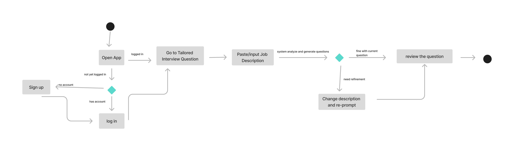
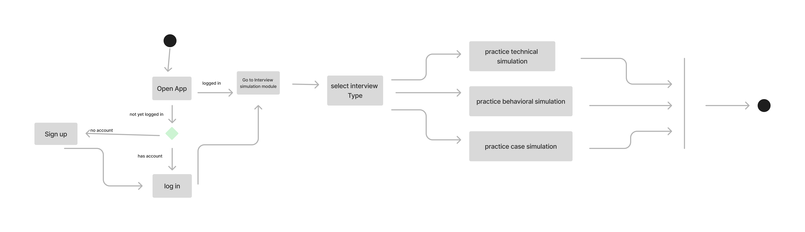

# Specification Phase Exercise

A little exercise to get started with the specification phase of the software development lifecycle. See the [instructions](instructions.md) for more detail.

## Team members

Yang Hu: [younghu312](https://github.com/younghu312)

Zirui Han: [ZiruiHan](https://github.com/ZiruiHan)

Zichao Jin: [ZichaoJin](https://github.com/ZichaoJin)

Ziqi Huang: [RyanH0417](https://github.com/RyanH0417)

## Stakeholders
Our stakeholder is a senior computer science student at NYU who is about to graduate and is looking for a data science or software development type of job, but he is anxious and nervous about his upcoming interviews, so he thought it would be great if there was software that could help him. 

His Struggle:
Many of the interview questions on the Internet are very general and not broken down by specific positions or specializations, so it would be a waste of time to search for questions on the Internet.

There is no feedback for practicing with the interview questions provided on the Internet, so it is difficult to tell if you have answered the questions well or poorly.

Doing the questions on a web page often involves keyboarding the answers, which is very different from a real interview scenario (e.g., video interviews). Interview scenarios are very different from real interviews (e.g., video interviews or inperson), and after doing a lot of interview questions using text, you will still be nervous during video interviews.

It is difficult to keep track of your own growth by searching for interview questions and answering them on a webpage, and thus you tend to lack motivation.

His goal:
After uploading a resume, the system can filter the questions for the user to find the best match and fit.

The system can provide partial or small amount of hints when the interviewer is completely out of ideas.

It would be better to have the option of text or video answers so that the interviewer can simulate real interview scenarios when needed, eliminating interview anxiety and nervousness when the time comes.

Saving past answers and feedback and having a trend analysis so that one can compare current and previous answers to see how much one has improved specifically, and also see one's long term progress trend through the trend graph.

## Product Vision Statement

we want an all-in-one interview prep app that automatically create tailored questions to your resume and target role, gives you instant feedback in text, audio, or video, and tracks your progress.

## User Requirements

- As a job seeker, I want to upload my resume once and have the system automatically pick up my tech stack, project experience, and years of experience, so it can recommend more accurate and relevant interview questions that match my background.

- As a job seeker, I want to paste the job description (including requirements and responsibilities) of my target role into the system, so it can generate tailored interview questions based on those needs. This way, I can practice more efficiently for that specific role.

- As a job seeker, I want to customize the types and difficulty levels of interview questions based on my needs, like focusing only on algorithm questions or behavioral interviews, so I can quickly strengthen my weak areas in a short time.

- As a job seeker, I want to answer questions in text, audio, or video formats. This will help me get used to real interview scenarios and allow me to review my performance to make improvements.

- As a job seeker, I want to get immediate scoring and brief feedback after answering each question, so I can quickly identify the strengths and weaknesses in my responses and improve on the spot.

- As a job seeker, I want to see supplementary materials or quick hint links when viewing questions. This way, I can dig deeper into related knowledge, industry context, or best practices instead of relying solely on memory.

- As a job seeker, I want the system to save all my practice answers and feedback records, so I can review my past responses and compare how I’ve improved over time.

- As a job seeker, I want to see visual stats on my dashboard, like average scores, accuracy trends, and response times. This will help me clearly understand my preparation progress and keep me motivated to keep going.

- As a job seeker, I want to experience different types of interview simulations in the system, like technical interviews, behavioral interviews, or case interviews. This will help me practice communication and problem-solving approaches for different formats before the real thing.

- As a job seeker, I want to receive personalized suggestions from the system after some practice, like “You’ve improved a lot on algorithm questions". This will help me focus on areas that need more work.

## Activity Diagrams

## Clickable Prototype

[Prototype](https://www.figma.com/proto/CO0g1ARDFmVx7XztaOXHTU/Lapis?node-id=38-169&p=f&t=bc4cXzEQVc52N57R-1&scaling=scale-down&content-scaling=fixed&page-id=0%3A1&starting-point-node-id=13%3A2)
